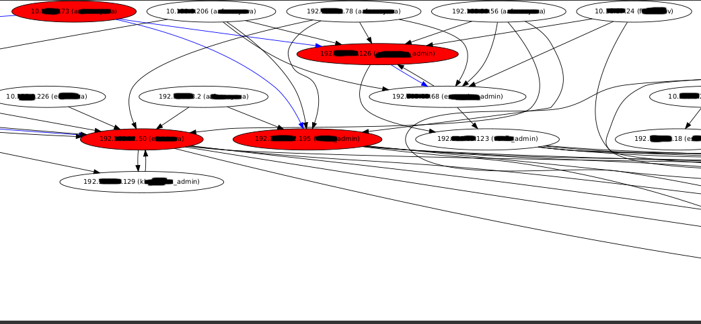

# hunt
Finding paths to target hosts in Active Directory infrastructure

This tool writes graph in dot-file.

## Specify targets

```
echo 10.0.0.1 >> targets.txt
echo 10.0.0.2 >> targets.txt
echo 10.0.0.3 >> targets.txt
```

## Obtaining needed information

### Getting remote sessions

Find DNS server:

`cat /etc/resolv.conf`

And then find DC ip-addresses:

`dig srv _ldap._tcp.corp.org @DNS`

Next for each domain controller or file server it need to run background (infinity) commands:

```
netview.py corp.org/username -target dc1 >> sessions.txt &
netview.py corp.org/username -target dc2 >> sessions.txt &
```

### Getting local administrators

Obtaining all windows hosts which consists in domain using LDAP-query:

`(objectClass=computer)`

For each windows hosts:

```
for ip in $(cat hosts.txt)
do 
echo $ip
net rpc group members Администраторы -U 'corp/username%password' -I $ip
net rpc group members Administrators -U 'corp/username%password' -I $ip
done > local_admins.txt
```
### Specify domain admins:

Each domain admin user or users who have initial access to target hosts:
```
echo users1_admin >> admins.txt
echo users2_admin >> admins.txt
echo users3_admin >> admins.txt
```
### Specify owned hosts (optional)

If target chain contains owned hosts path will be highlighted blue

```
echo 10.10.0.1 >> owneds.txt
echo 10.10.0.2 >> owneds.txt
```

## Hunting

`./hunt.py`

See results:

`xdot out.dot`


